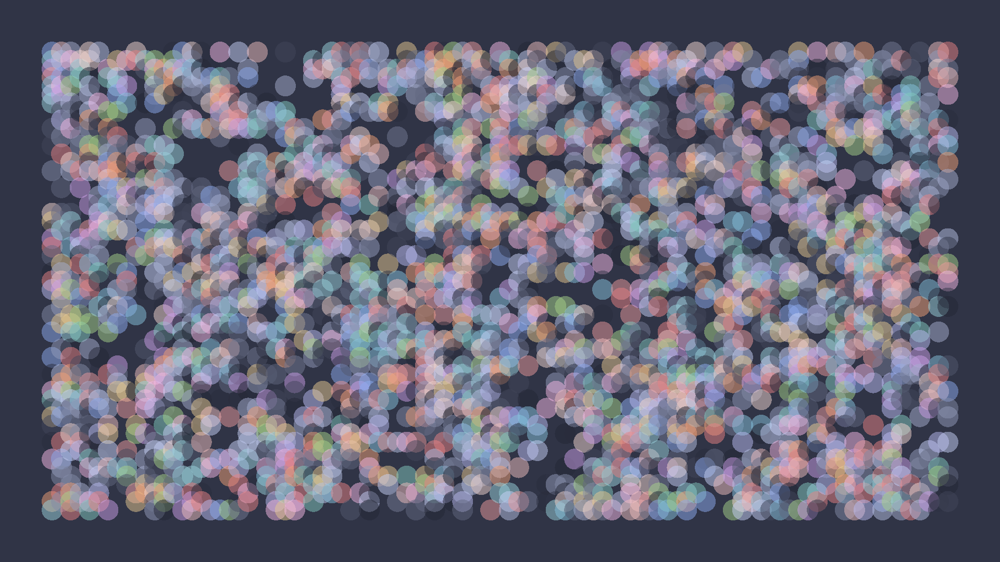
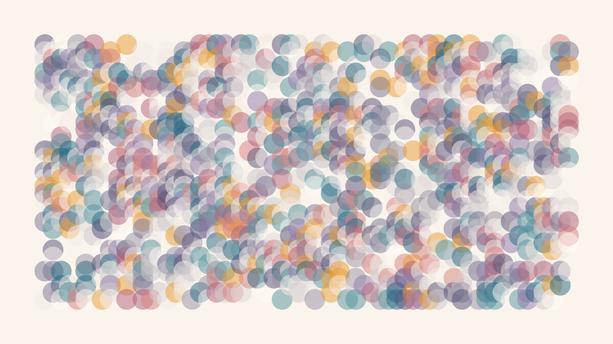

# Samples

## Catppuccin

### Frappé

```bash
$ wally --seed 112641447063653 -p catppuccin-frappe dots
```



### Latte

```bash
$ wally --seed 465491489893 --padding 140 -p catppuccin-latte dots -s 30
```


### Macchiato

```bash
$ wally --seed 7881690122970821743 -p catppuccin-macchiato dots -d 100 -s 120
```


### Mocha

```bash
$ wally --seed 470020221025 --padding 150 -p catppuccin-mocha dots -d 50 -s 50
```


## Rosé Pine

### Dawn

```bash
$ wally --seed 1684109166 --padding 100 -p rose-pine-dawn dots -d 30 -s 12
```



### Default

```bash
$ wally --seed 28258988067220596 --padding 250 -p rose-pine-default dots -d 160 -s 160
```


### Moon

```bash
$ wally --seed 1836019566 --padding -p rose-pine-moon 180 dots -d 80 -s 60
```


